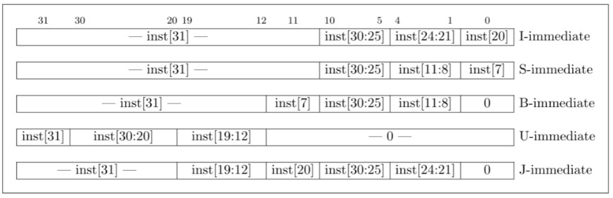
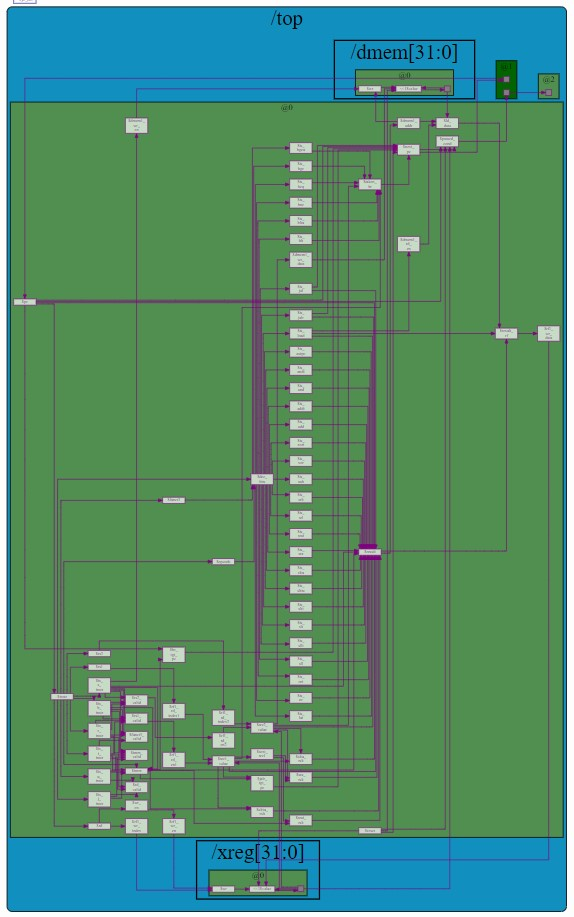

# Complete-pipelined-RISC-V-CPU-core-
### This is a project I was able to develop while taking a course from Linux Foundation on Building a RISC-V CPU Core (LFD111x). It implements a complete RISC-V CPU core. I am using Transaction-Level Verilog (TLV) language extension, to perform instruction-level parallelism, by dividing incoming instructions into a series of sequential steps (the eponymous "pipeline"). This arrangement lets the CPU complete an instruction on each clock cycle. Using the Makerchip online integrated development environment (IDE), an open source tool that can easily be accessed by anyone. It is also an evolving platform.

## About Makerchip IDE
Although you can edit your code live on web browser in the Makerhcip IDE, you can also launch Makerchip from your desktop to work with a local TL-Verilog source file. Makerchip will run in your browser, but autosaves back to your desktop. You can install the Makerchip app first:
```
pip3 install makerchip-app
```
Then launch the makerchip app at a path where you store your local TL-Verilog source file:
```
makerchip <path>/<local_TL_file>.tlv
```

 Makerchip provides random stimulus for dangling inputs, making it a really convenient tool to use, as there is no need to write a test bench to provide stimulus (input) to your design. When opening any available example of the platform, one can play and get familiar real quick with it. It consists of an editor pane, where you can edit your own circuit, everything is written in (\TLV code blocks in this design) a NAV-TLV pane where TLV macros are expanded and a log outputs tab, where one can track for errors or warnings. Compilation and simulation happen at the same time, resulting in a logic diagramm of the circuit designed, while also providing with the output waveforms tab. VIZ tab could be used to further simplify debug for large designs.

Typically, you would create your own custom visualizations as you develop your circuit, so you can see the big picture simulation behavior more easily. However, thanks to the course benefits, this was provided for me. You can see the visualization code in the NAV-TLV pane, where macros are expanded.

### Before jumping in the actual design though, it is worth mentioning a few things about TL-Verilog. 

 TL-Verilog source file is first processed by a macro preprocessor called M4. This is how visualization was also implemented, importing its library and instantiating. The resulting TL-Verilog file is processed into SystemVerilog or Verilog by Redwood EDA’s SandPiper™ tool. Verilator is an open-source tool used to compile your Verilog code into a C++ simulator. This simulator is run to produce the trace data that you can view in the waveform viewer. The LOG tab shows output from all these tools. Output from M4 and SandPiper is in blue, and output from Verilator and its resulting simulation are in black. TL-Verilog features are used to define the logic within a (System)Verilog module.

 TL-Verilog is really a Verilog implementation of TL-X, a language extension defined to layer atop any HDL to extend it with transaction-level features. So there is a migration path from any supported HDL (and, as of this writing, Verilog is the only one). The ultimate goal of this Verilog evolution, is to eventually introduce a new modeling language philosophically different from Verilog in all respects. This will play out over the next decade or decades. In the meantime, this is done incrementally, layering on Verilog as a working starting point, with TL-Verilog as a language extension to Verilog. This layering also provides an essential and incremental migration path. And, as tools mature, it is always possible to fall back on Verilog.

## About RISC-V architecture 
 RISC-V has very rapidly gained popularity due to its open nature--its explicit lack of patent protection and its community focus. Following the lead of RISC-V, MIPS and PowerPC have subsequently gone open as well. "RISC", in fact, stands for "reduced instruction set computing" and contrasts with "complex instruction set computing" (CISC). RISC-V (pronounced "risk five") is the fifth in a series of RISC ISAs from UC Berkeley. Like other RISC (and even CISC) ISAs, RISC-V is a load-store architecture. It contains a register file capable of storing up to 32 values. Load and store instructions transfer values between memory and the register file. All instructions are 32 bits.
RISC-V instructions may provide the following fields:
 * opcode: Provides a general classification of the instruction and determines which of the remaining fields are needed, and how they are laid out, or encoded, in the remaining instruction bits.
 * function field(funct3/funct7)
 * rs1/rs2: The indices (0-31) identifying the register(s) in the register file containing the source operand values on which the instruction operates.
 * rd: The index (0-31) of the register into which the instruction’s result is written.
 * immediate: A value contained within the instruction bits themselves. This value may provide an offset for indexing into memory or a value upon which to operate (in place of the register value indexed by rs2).

Below a RISC-V base instruction format is presented, from 


To determine the type of instruction , you can examine its opcode, first two bits must be 2'b11 for valid RV321 instructions, every instruction is assumed to be valid. The ISA defines the instruction type to be determined as follows. Gray cells can be ignored as these are not used in RV321


The immediate value is a bit more complicated. It is composed of bits from different fields depending on the type.


To determine a specific instruction , knowledge of a decode table is required. This is given from the RV321 base instruction set


## The design
This design is focused on the CPU core only, ignoring all of the logic that would be necessary to interface with the surrounding system, such as input/output (I/O) controllers, interrupt logic, system timers. Sources of complexity, like caches used to hold recently-accessed memory data close to the CPU core are also ignored here. The aim is to implement separate, and very small, instruction and data memories. IMem and DMem are typical seperate, single cycle instruction and data caches. As a result, this CPU is closer to a microcontroller's CPU rather than a desktop's one. It will execute a test programm of summing up numbers 1 through 10. The CPU components are shown below.

### 1. PC logic
This logic is responsible for the program counter (PC). The PC identifies the instruction our CPU will execute next. Most instructions execute sequentially, meaning the default behavior of the PC is to increment to the following instruction each clock cycle. Branch and jump instructions, however, are non-sequential. They specify a target instruction to execute next, and the PC logic must update the PC accordingly.
### 2. Fetch
The instruction memory (IMem) holds the instructions to execute. To read the IMem, or "fetch", we simply pull out the instruction pointed to by the PC.
### 3. Decode Logic
Now that we have an instruction to execute, we must interpret, or decode, it. We must break it into fields based on its type. These fields would tell us which registers to read, which operation to perform, etc.
### 4. Register File Read
The register file is a small local storage of values the program is actively working with. We decoded the instruction to determine which registers we need to operate on. Now, we need to read those registers from the register file.
### 5. Arithmetic Logic Unit(ALU)
Now that we have the register values, it’s time to operate on them. This is the job of the ALU. It will add, subtract, multiply, shift, etc, based on the operation specified in the instruction.
### 6. Register File Write
Now the result value from the ALU can be written back to the destination register specified in the instruction.
### 7. DMem
Our test program executes entirely out of the register file and does not require a data memory (DMem). But no CPU is complete without one. The DMem is written to by store instructions and read from by load instructions.

## Implementation 
In order to decide the type of the instruction , assignments , according to table for instruction types in section "About RISC-V architecture", are made for each type of instruction. Next, rs1,rs2,rd and funct3 fields are examined for their validity after extracting from instruction bits. Then, immediate field is assigned according to its structure presented in previous section. The register file is generated through a TL-verilog array definition expanded from M4 macro preprocessor library. IMEM read-only memory is also implemented this way, this memory is constantly on read-mode. It deos not have a read enable input, but its potential power savings are not of concern in this design. This array memory, provides its output data in the same clock cycle as the input address. as a macro, this would result in an implementation using flip-flops  that would be far less optimal than SRAM.


Α series of bits called dec_bits is defined using instruction's 30th bit , funct3 and opcode fields. Based on this, specific operations are decided. ALU is then implemented using these operations to decide the corresponding 32-bit result. What's important here , is the branch logic, which is implemented bsaed on a taken_br single bit variable. This variable is 1 , whenever a branch operation occurs and 0 by default. Caution needs to be taken on next pc logic, whenever a branch or jump conditions is met, next_pc is assigned to a branch target variable based on branch or jump instruction. All load/store instructions operate on words, assuming the lowest two address bits are zero, to avoid complexity of single byte read/write or half-words (2 bytes) read/write. 


## Simulation

The test programm executes assembly instructions in the \SV code block, using several registers to sum numbers 1 through 9. It also stores a value on a specified register. The user can play with these and experiment, by adding instructions with the same format and watching it execute step by step on the VIZ pane. On the VIZ pane, you can also have a live view of the register file internal registers as well as DMEM's. The output diagramm generated for the complete RISV-V CPU is shown below.

The output diagram shown for the complete RISC-V is the following 



ALl the connections of every signal and their connections between them are shown, where one can select a signal or register and view its related ones as well as the direction of connectivity. Output waveform can also be viewn in the 'WAVEFORM' tab. There you can view all the output waveforms of every signal, dmem and register file registers.  
